# Running Phoenix on a Mac

The following are instructions for how to run Phoenix WinNonlin on a Mac computer. Note: This will probably not work on the Apple Silicon Macs that were just announced, but you most likely don't have those yet anyway.

## Step 1 - Make a PC virtual machine.

The first step will be to make a PC virtual machine. You will need a free software package called "VirtualBox". What this does is to simulate a PC inside your Mac. This software is available [here](https://www.virtualbox.org/). Make sure you download the version for "OS X hosts". After you have installed VirtualBox, you then need to download Windows 10 to install on the virtual machine you are going to make. Luckily, UW-Madison has a software license for Windows 10 that students can use. You can access the campus software library [here](https://software.wisc.edu/cgi-bin/ssl/csl_download.cgi) - go to "Microsoft for personally-owned computers", then click on the link marked "Microsoft Windows 10 Education 64-bit for students". That will download the `.iso` file you need to install Windows 10 and you should receive a license key to your UW email within one hour. After you have downloaded this file and you have installed VirtualBox, run VirtualBox, and do the following:

1. Click the "New" button in VirtualBox

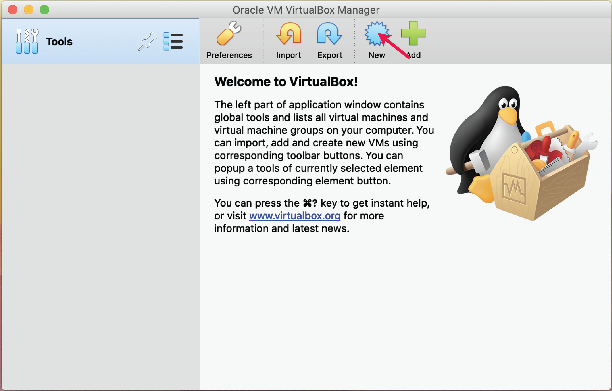

2. At this point, you can name the VM whatever you want, but make sure to set the type to "Microsoft Windows" and the version to "Windows 10 (64-bit)"

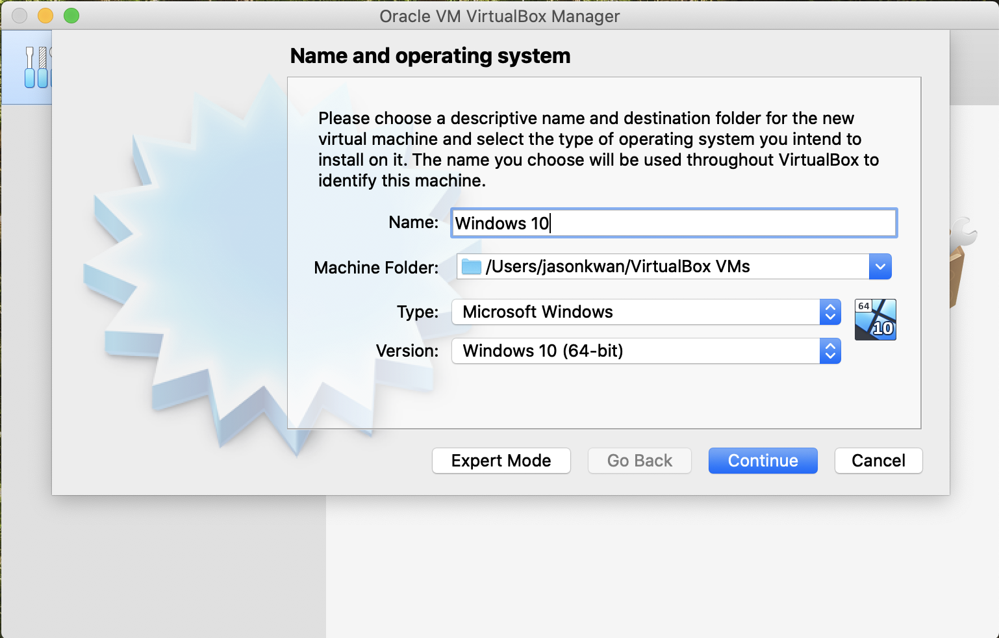

3. It is probably a good idea to give the VM 2 GB of RAM or more, assuming you have that much on your host machine. I give it 4 GB here.

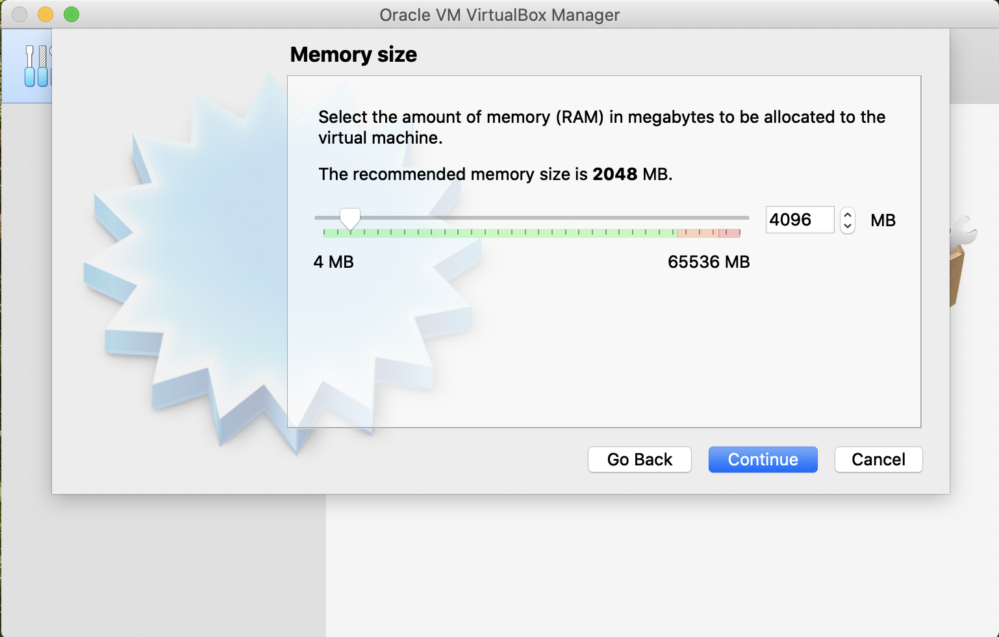

4. Then you need to make a virtual hard disk for your VM - this is basically a file on your host computer that is used to simulate a separate hard disk for the VM. First choose "Create a virtual hard disk now".

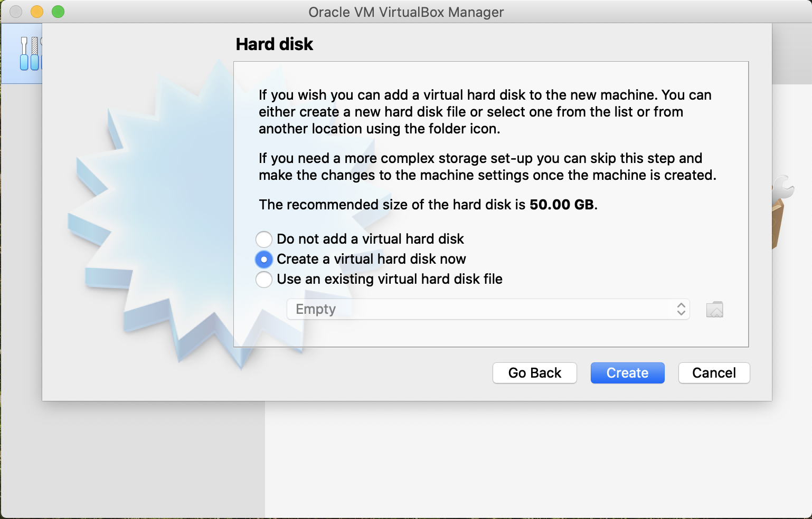

Then I choose VDI. I'm not sure it really matters what type you choose here.

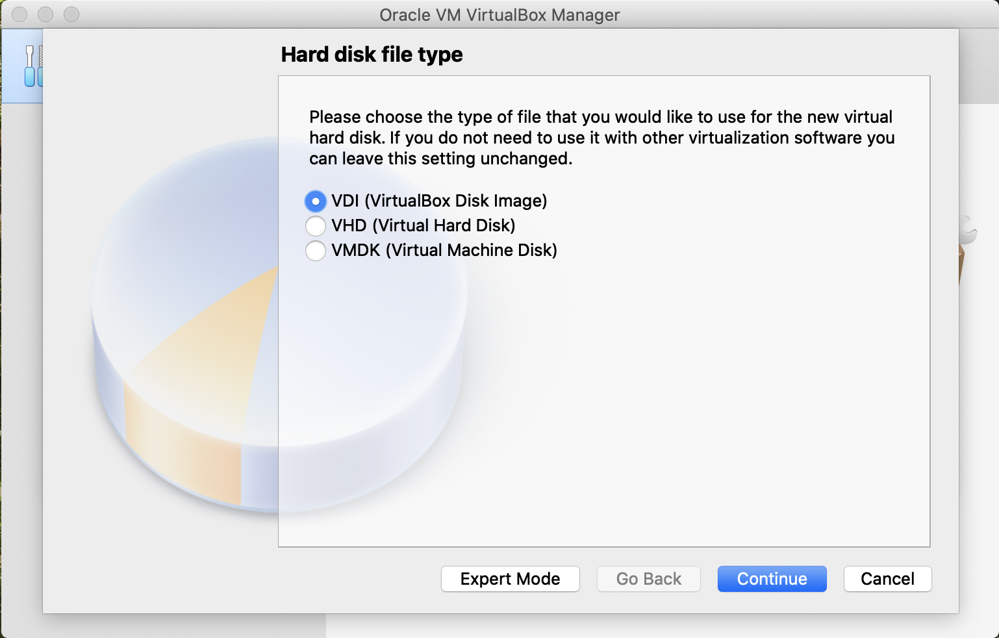

After that it is probably best to choose "dynamically allocated". What this means is that the hard disk looks like a certain size to the VM (for example, 50 GB), but it will only take up that entire amount of space on your host computer when you have filled up the virtual hard disk.

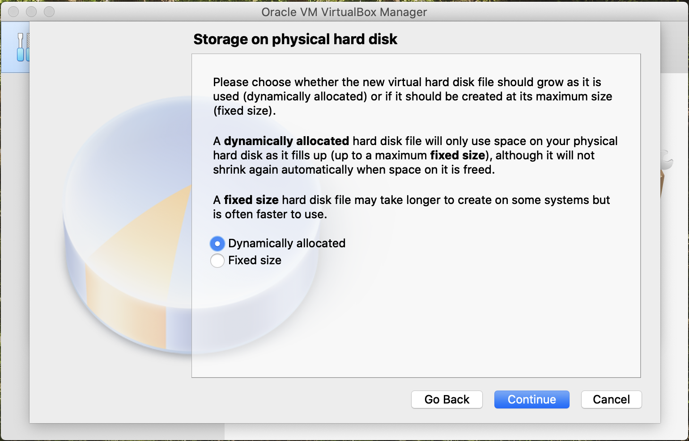

...and you can choose whatever size you want for the hard disk (assuming you have enough space), but the minimum should probably be about 50GB.

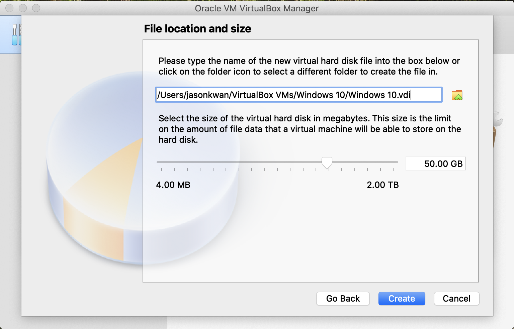

5. With the "Windows 10" VM selected on the left of the window, click the "start" button, as indicated below.

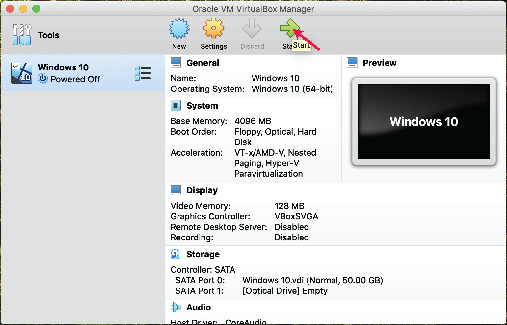

At that point you will be met with this dialog - what it is asking is if you have a file that you want to use as the boot media for the VM. Here we need to choose the Windows 10 install `.iso` file you downloaded. To do that, first click on the sort of folder icon indicated below.

Then will add a disk image file, first by clicking on the "add" icon as shown below.

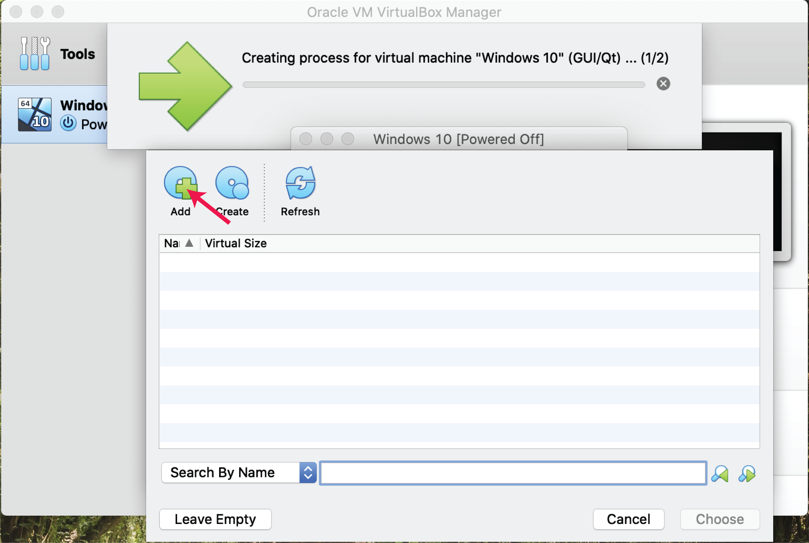

Then a file picker dialog box will come up - navigate to where your `.iso` file is, and pick it, then click "open"

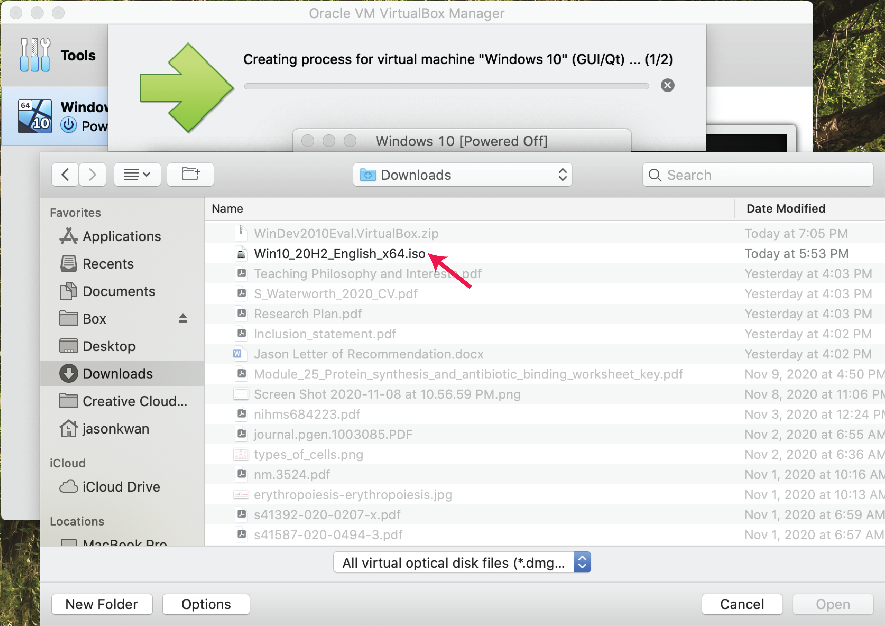

You will be back to the previous dialog box. Here you need to make sure the Windows 10 `.iso` is selected, then click "choose".

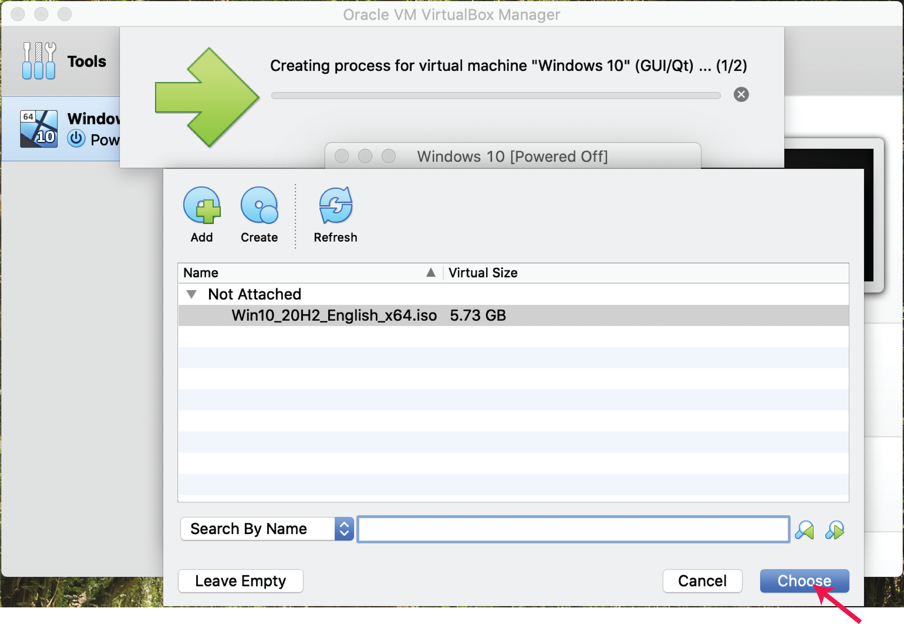

You will then be back to this screen, where you need to click "Start".

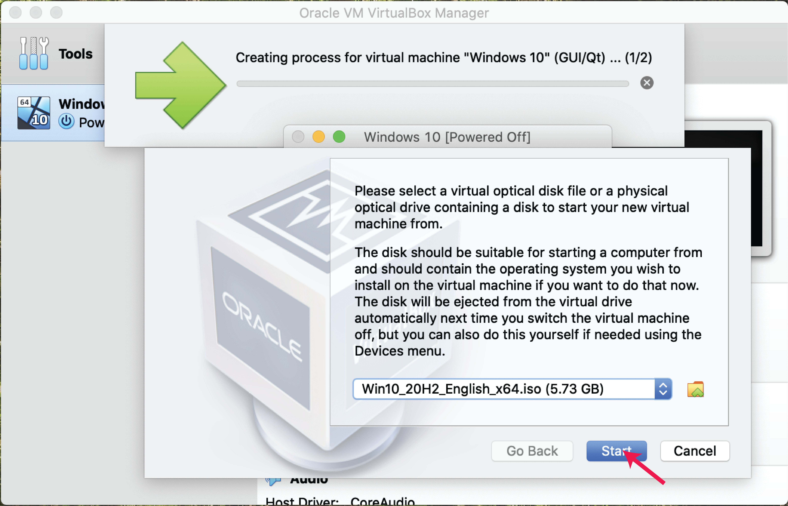

6. Set up the Windows installation.

After starting the VM, you will have the following initial screen.

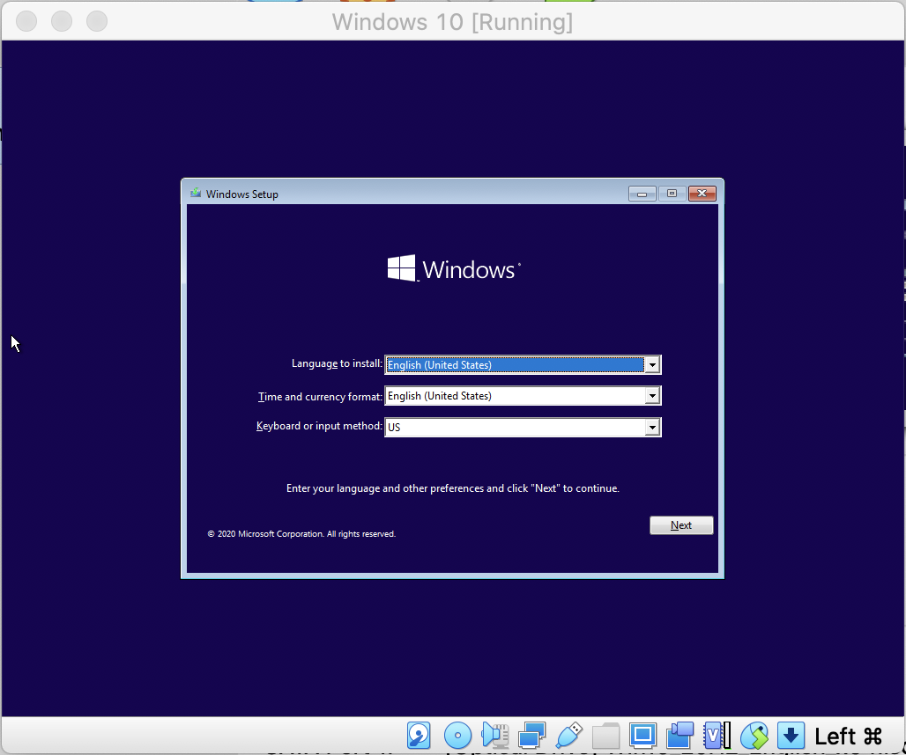

You basically just need to pick the appropriate region, keyboard etc. for a few of these set up screens, until you have windows installed. You will use the license key that was sent to your e-mail address. When everything is done, you should end up with a screen that looks like this:

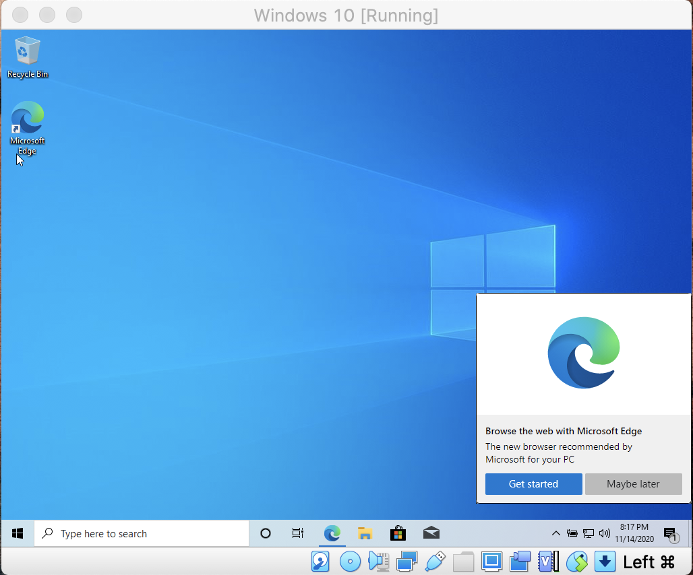

7. Install Phoenix WinNonlin.

Within the VM, you can use the Edge browser to access your e-mail with details on how to install Phoenix WinNonlin. You can use the link in the e-mail to download the software. After installing you will be asked to restart the VM, but conveniently enough there will be a Phoenix icon added to the desktop. You will then have to run the licensing wizard using the instructions you were given in the e-mail to activate the software.